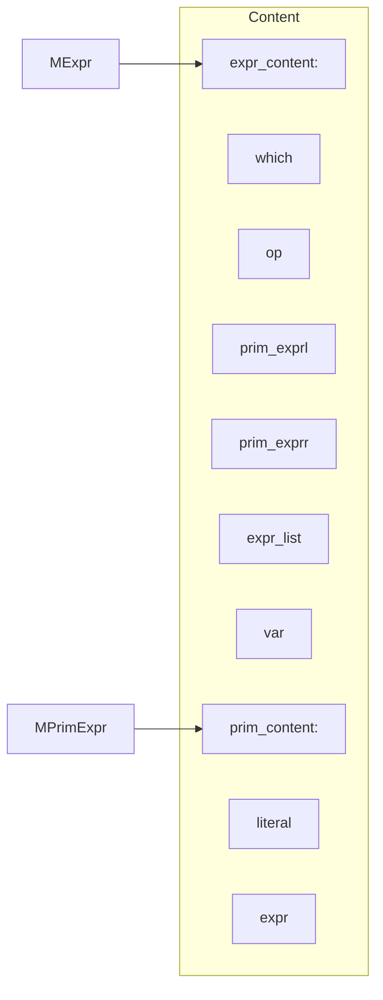

# Structure of CompileLab

## About MBlock and MMethod
> MScope
>> MBlock  
>> MMethod

## But, what's MBlock?
### It can be
- block
- assignment-statement
- arrayassignment-statement
- if-statement
- while-statement
- print-statement

## Structure of MExpr

