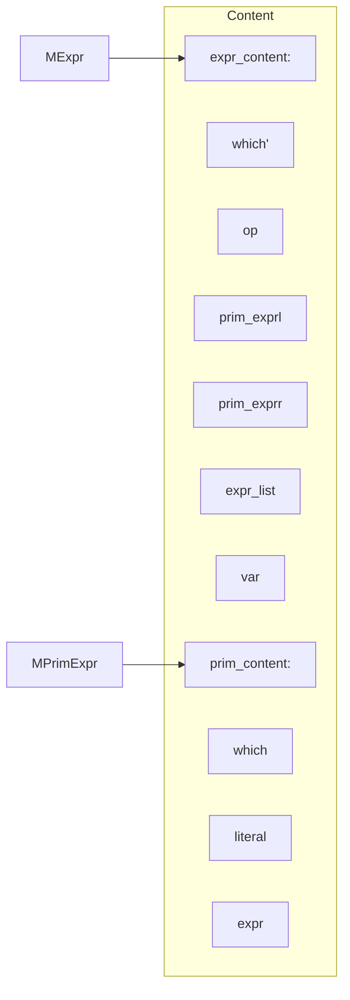

# Structure of CompileLab

## What errors should we check?
- Using of undefined:
  - class
  - method
  - variable
- Duplicate definition of:
  - class
  - method
  - variable
- Type mismatch:
  - Expression in "if" or "while" should be boolean expression
  - Parameter in "println" should be an integer
  - The index of an array should be an integer
  - The left and right operands of an assignment must match the type
- Parameters mismatch:
  - Type, number, return type
  - Reloading is not allowed
- Operands of "+", "/" and "*" should be integers
- Circulation inheritance or multiple inheritance of class

## The phase of our work
### Phase 1
The program iterates through the syntax tree top-down, and constructs a symbol table.

## About MBlock and MMethod
> MScope
>> MBlock  
>> MMethod

## But, what's MBlock?
### It can be
- block
- assignment-statement
- arrayassignment-statement
- if-statement
- while-statement
- print-statement

## Structure of MExpr

